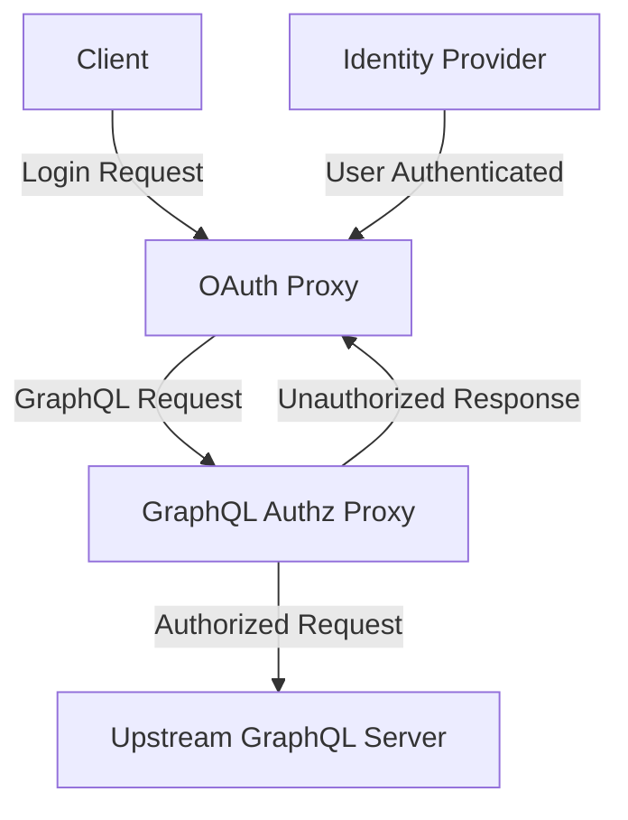

# graphql-authz-proxy


Proxy to enforce authorization rules on GraphQL APIs.

## Features

- Enforces fine-grained authorization for GraphQL queries and mutations
- Supports config-driven user/group/policy management
- Easy integration with existing GraphQL servers

## Usage

### Running the Proxy

You can run the proxy using the CLI:

```bash
gqlproxy start --upstream-url <UPSTREAM_GRAPHQL_URL> --users-config <users.yaml> --groups-config <groups.yaml>
```

Or with Docker:

```bash
docker run -p 8080:8080 \
  -v $(pwd)/users.yaml:/app/users.yaml \
  -v $(pwd)/groups.yaml:/app/groups.yaml \
  kgmcquate/graphql-authz-proxy:latest \
  --upstream-url <UPSTREAM_GRAPHQL_URL> --users-config /app/users.yaml --groups-config /app/groups.yaml
```

## Typical Architecture

Here are some common deployment architectures for the proxy:

### Using OAuth Proxy for Authentication



## Request Header Requirements

These headers must be included in each request to identify the user:

- `X-Forwarded-Email`: The email address of the user

- `X-Forwarded-Preferred-Username`: (Optional) The preferred username of the user

- `X-Forwarded-User`: The unique identifier of the user
  
- `X-Forwarded-Access-Token`: The access token for the user

### Identity Providers

The proxy does not handle authentication itself. It relies on upstream identity providers (IdPs) to authenticate users and pass user information via HTTP headers.

## Configuration

### Users Config

```yaml
users:
  - email: "kgmcquate@gmail.com"
    username: "kgmcquate"
    groups:
      - "admin"
  - email: "bob@company.com"
    username: "bob"
    groups:
      - "viewers"
```

### Groups Config

Examples available in [examples/configuration/permissions_examples.md](examples/configuration/permissions_examples.md)

## Notes

- All config files must be valid YAML and match the schema above.
- `field_name: "*"` means all fields/operations are allowed/denied.

## License

MIT
